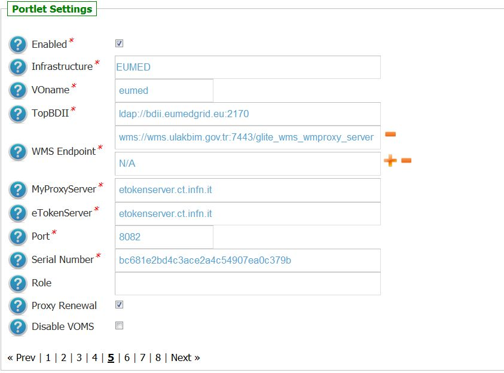
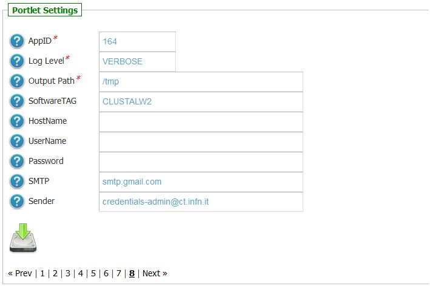
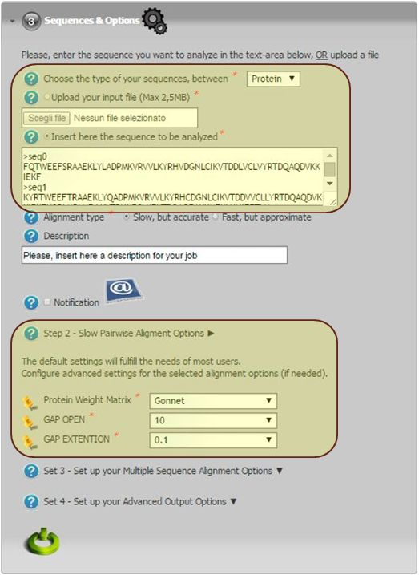

*********************
CLUSTALW
*********************

-------------

============
About
============

.. _1: http://www.clustal.org/
.. _2: http://www.clustal.org/clustal2/#Documentation
.. _3: http://www.ncbi.nlm.nih.gov/pubmed/17846036
.. _4: images/clustalW.mp4 
.. _5: https://sgw.africa-grid.org/
.. _6: http://www.eumedgrid.eu/

ClustalW2 [1_] is a widely used multiple program for multiple alignment of nucleic acid and protein sequences. sequence alignment computer program.

The program accepts a wide range on input formats including: NBRF/PIR, FASTA, EMBL/Swissprot, Clustal, GCC/MSF, GCG9 RSF, and GDE, and executes the following workflow:

- Pairwise alignment;

- Creation of a phylogenetic tree (or use a user-defined tree);

- Use of the phylogenetic tree to carry out a multiple alignment

Users can align the sequences using the default setting but occasionally it may be useful to customize one's own parameters. The main parameters are the gap opening penalty and the gap extension penalty.

For more information:

- Consult the official documentation [2_];

- Clustal W and Clustal X version 2.0 [3_];

- The MP4 file is a video [4_] showing how to use the ClustalW from the Africa Grid Science Gateway [5_]

============
Installation
============
To install this portlet the WAR file has to be deployed into the application server.

As soon as the portlet has been successfully deployed on the Science Gateway the administrator has to configure:

- the list of e-Infrastructures where the application can be executed;

- some additional application settings.

1.) To configure a generic e-Infrastructure, the following settings have to be provided:

**Enabled**: A true/false flag which enables or disable the generic e-Infrastructure;

**Infrastructure**: The acronym to reference the e-Infrastructure;

**VOName**: The VO for this e-Infrastructure;

**TopBDII**: The Top BDII for this e-Infrastructure;

**WMS Endpoint**: A list of WMS endpoint for this e-Infrastructure (max. 10);

**MyProxyServer**: The MyProxyServer for this e-Infrastructure;

**eTokenServer**: The eTokenServer for this e-Infrastructure;

**Port**: The eTokenServer port for this e-Infrastructure;

**Serial Number**: The MD5SUM of the robot certificate to be used for this e-Infrastructure;

In the following figure is shown how the portlet has been configured to run simulation on the EUMEDGRIDSupport e-Infrastructure [6_].

2.) To configure the application, the following settings have to be provided:

**AppID**: The ApplicationID as registered in the UserTracking MySQL database (GridOperations table);

**Software TAG**: The list of software tags requested by the application;

**SMTP Host**: The SMTP server used to send notification to users;

**Sender**: The FROM e-mail address to send notification messages about the jobs execution to users;

In the figure below is shown how the application settings have been configured to run on the Africa Grid Science Gateway [5_].

============
Usage
============

To perform the Multi Sequence Alignment for DNA or protein the user has to:

- click on the *third* accordion of the portlet,

- choose the sequence type (e.g.: *DNA* or *protein*),

- upload the sequence as ASCII file OR use the default one pre-configured clicking in the textarea below, 

- configured additional settings if needed as shown in the below figure:

Each simulation will produce:

- *std.out*: the standard output file;

- *std.err*: the standard error file;

- *.tar.gz*: containing the results of the Monte Carlo simulation.

A typical simulation produces, at the end, the following files:

.. code:: bash

        ]$ tree SequenceAlignmentSimulationStarted_126163/
        SequenceAlignmentSimulationStarted_126163/
        ├── std.err
        ├── std.out
        ├── output.README
        └── outputs.tar.gz

        ]$ tar zxvf outputs.tar.gz 
        20150601120928_larocca.aln
        20150601120928_larocca.dnd

============
Contact
============
Please feel free to contact us any time if you have any questions or comments.

.. _INFN: http://www.ct.infn.it/

:Authors:
 
 `Roberto BARBERA <mailto:roberto.barbera@ct.infn.it>`_ - Italian National Institute of Nuclear Physics (INFN_),

 `Giuseppe LA ROCCA <mailto:giuseppe.larocca@ct.infn.it>`_ - Italian National Institute of Nuclear Physics (INFN_),
 
